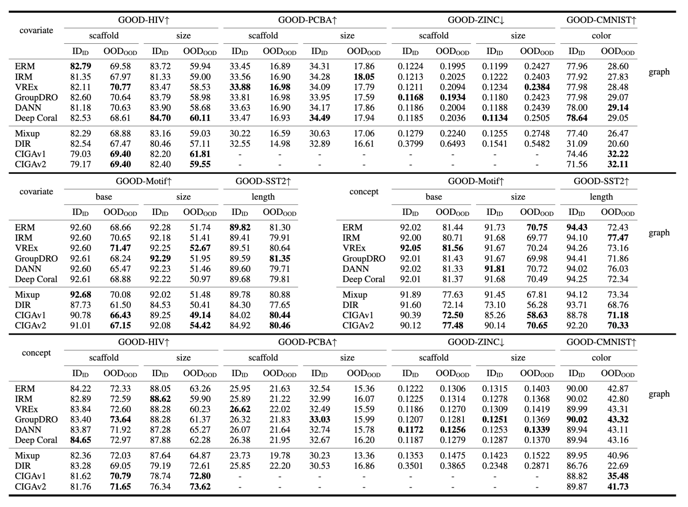

# CIGA Implementation under GOOD Benchamrk
This repo contains the [CIGA](https://github.com/LFhase/CIGA) implementation under [GOOD](https://github.com/divelab/GOOD) Benchmark 🚀.

### Hyperparemeter Configurations
The hyper-parameter configurations are given in yaml files under the following folders:
- CIGAv1: `configs/final_configs/{dataset}/CIGA.yaml`
- CIGAv2: `configs/GOOD_configs/{dataset}/CIGA.yaml`
The sweeping is performed under the recommended protocol of the benchmark.
Specifically, the final hyperparameters are selected according to the OOD validation performance under three random seeds in `1 5 10`.

### Benchmarking Progress
Now the benchmarking results of CIGA covers **both** `covariate` and `concept` shifts in the following `graph classification` datasets:
- GOODMotif
  - [x] basis
  - [x] size
- GOODCMNIST
  - [x] color
  - [x] background
- GOODHIV
  - [x] scaffold
  - [x] size
- GOODSST2
  - [x] length
- GOODZINC
  - [ ] scaffold
  - [ ] size
- GOODPCBA
  - [ ] scaffold
  - [ ] size
- GOODPCBA
  - [ ] scaffold
  - [ ] size

We will continue update the results for the left datasets and `node classification` datasets.

### Benchmark Results
The following results are obtained from `10` random seeds, strictly following the evaluation protocol of GOOD.
Full results with standard deviations can be found in this [online table](https://docs.google.com/spreadsheets/d/1_v38zrC6d4pq6Xq4DL9z1eYQb6SCFmU4m-jAewXK_9I/edit?usp=sharing).
Here we also provide an overview:

<em>Figure 1.</em> An overview of CIGA performances on GOOD datasets.

